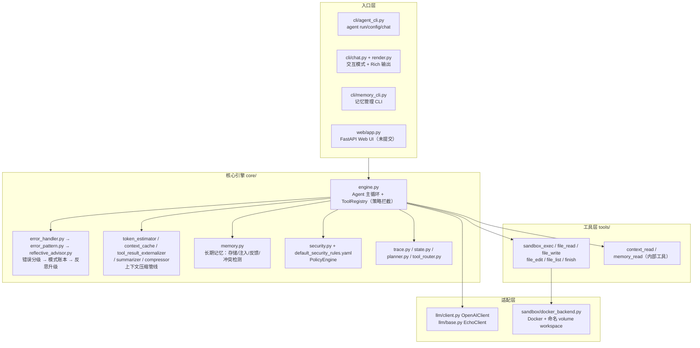
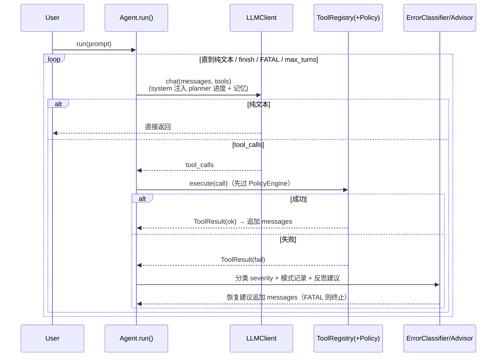

# CodeMap — Hermes Agent 项目总图（project mode）

> 生成：2026-07-17（SDD-RIPER-ONE `create_codemap`，project 模式）
> 验证基线：`pytest tests/` = 541 passed, 1 skipped（2026-07-17 实测）
> 用途：代码库索引与上下文切片。后续会话按需按路径回读，不全量扫描。
> 历史版本：根目录 `CODEMAP.md`（2026-07-12 版，本图取代其索引地位；其内容仍有效但缺 web 模块）

---

## 1. 项目锚点

| 项 | 值 |
|---|---|
| 名称 | Hermes Agent / Code Sandbox Agent |
| 定位 | 具备自我纠错能力的 LLM Agent 框架：写代码 → 执行 → 观察 → 修正 → 交付 |
| 路径 | `D:\djh\hermes\project1` |
| Python | >= 3.10（推荐 3.11）；venv: `C:\Users\msn\AppData\Local\hermes\hermes-agent\venv\` |
| 布局 | src-layout，源码 `src/agent/`（41 个 .py） |
| 质量门禁 | `pytest tests/` + `mypy src/`（strict）+ `ruff check src/ tests/`（行宽 100） |
| Git | `master`，HEAD = `ddca73d`；**工作区有大量未提交改动**（Phase 4.7 + TD-001 + Web UI） |

---

## 2. 架构分层图



## 3. 主循环数据流（自我纠错闭环）



---

## 4. 模块索引（按路径回读）

### 4.1 入口层
| 路径 | 职责 | 关键符号 |
|---|---|---|
| `src/agent/cli/agent_cli.py` | argparse 主 CLI：run/config/chat/--version | `build_parser()`, `main()` |
| `src/agent/cli/chat.py` | 交互式多轮对话循环 | `run_chat_loop()` |
| `src/agent/cli/render.py` | Rich 渲染 + `--plain` 回退 | `render_result()` 等 |
| `src/agent/cli/memory_cli.py` | 记忆 list/show/delete/feedback/audit/export | `main()` |
| `src/agent/web/app.py` | ⚠️ **未提交** FastAPI Web UI：按 session_id 内存保存 Agent，无 Key 回退 EchoClient | `app` |
| `scripts/hermes-memory.py` | 记忆 CLI 独立入口脚本 | — |

### 4.2 核心引擎 `core/`
| 路径 | 职责 | 关键符号 |
|---|---|---|
| `engine.py` | Agent 主循环、工具注册执行、策略拦截、记忆/压缩/Trace 接入点 | `Agent`, `ToolRegistry` |
| `types.py` | 基础数据类型 | `Message`, `ToolCall`, `ToolResult`, `ToolSpec` |
| `state.py` | 执行状态 | `AgentState`, `ExecutionContext`（⚠️ 未接入工具，TD-004） |
| `trace.py` | 执行轨迹 | `AgentTrace`, `TraceEvent` |
| `error_handler.py` | 错误分级（未知异常保守 FATAL） | `ErrorClassifier` |
| `error_pattern.py` | 重复错误模式账本 | `ErrorPatternLedger` |
| `reflective_advisor.py` | 反思策略（只升级不降级） | `ReflectiveAdvisor` |
| `security.py` | 策略引擎 | `PolicyEngine`, `PolicyRule` |
| `default_security_rules.yaml` | 默认宽松规则集 | — |
| `memory.py` | 长期记忆全套 | `MemoryManager`, `StructuredMemoryStore`, `MemoryConflictDetector` |
| `token_estimator.py` / `context_cache.py` / `tool_result_externalizer.py` / `summarizer.py` / `compressor.py` | 上下文压缩管线 | `HybridCompressor` 等 |
| `planner.py` / `tool_router.py` | 任务规划 / 工具提示 | `TaskPlan`, `ToolRouter` |

### 4.3 适配层
| 路径 | 职责 | 关键符号 |
|---|---|---|
| `llm/base.py` | 抽象 + 测试桩 | `BaseLLMClient`, `EchoClient` |
| `llm/client.py` | OpenAI 兼容（httpx，重试/超时/from_env；无流式） | `OpenAIClient` |
| `sandbox/docker_backend.py` | Docker 全生命周期 + 命名 volume `/workspace` 持久化（TD-001 已修） | `DockerSandboxBackend` |

### 4.4 工具层 `tools/`
| 路径 | 说明 |
|---|---|
| `__init__.py` | `register_default_tools()` / `register_tools_from_config()` |
| `sandbox_exec.py` | 沙箱执行 Python |
| `file_read/write/edit/list.py` | 文件操作（write/edit 走 `file/path` write 策略） |
| `finish.py` | 终止循环并交付 |
| `context_read.py` / `memory_read.py` | 内部工具（闭包注入，TD-005） |

### 4.5 配置与日志
| 路径 | 说明 |
|---|---|
| `config.py` | Pydantic + YAML：`AgentConfig`（含 LLM/Sandbox/Security/Memory/Tools） |
| `logging.py` | structlog 双模式 |

---

## 5. 测试地形（41 个测试文件，541 passed / 1 skipped）

- 单元：`test_config / test_logging / test_core / test_agent_loop / test_state / test_planner / test_tool_router / test_llm_client`
- 沙箱/工具：`test_sandbox`（61 例）/ `test_tools` / `test_tool_security` / `test_sandbox_security`
- 机制：`test_trace / test_error_pattern / test_reflective_* / test_context_compression / test_memory_* / test_security_*`
- 入口：`test_cli / test_cli_chat / test_memory_cli / test_web_ui`（82 行，⚠️ 未提交）/ `test_examples / test_demo / test_docker_launch`
- 文档防腐：`test_architecture / test_usage_docs / test_readme / test_evaluation_log`
- 集成：`test_integration / test_reflective_integration / test_security_integration / test_memory_integration`

## 6. 文档与 Spec 资产

| 路径 | 角色 |
|---|---|
| `docs/progress-spec.md` | 跨会话进度唯一真相源（旧体系） |
| `docs/session-context.md` | 教学模式与工程规范 |
| `docs/evaluation-log.md` | 评测/Bug/STAR 素材 |
| `docs/plans/` | 原始阶段计划 + phase-8.4/9 计划 |
| `.kimi/vibe_specs/` | 28 份历史任务 spec + `technical-debt-spec.md`（技术债总表） |
| `mydocs/` | **本目录起为 SDD-RIPER-ONE 标准产物区**（codemap/specs/context/archive） |

## 7. 热点与风险（Execute 前必读）

1. **未提交工作区**：Phase 4.7（file_write/file_edit）、TD-001（workspace volume）、Web UI（`src/agent/web/` + `test_web_ui.py`）均未 commit；任何 Execute 前需先决定提交策略。
2. **TD-002/003**：`subprocess` 后端未实现，`config.sandbox.backend` 被忽略——Docker 不可用时闭环断裂。
3. **TD-004/005**：`ExecutionContext` 未接入工具；内部工具闭包注入致 `Agent.__init__` 膨胀。
4. **TD-006**：文件写操作缺 workspace 边界限制（安全层面）。
5. **TD-007**：Docker Hub 拉取受网络限制，需镜像源/fallback。
6. `OpenAIClient` 缺流式输出（功能缺口，非债务）。

## 8. 常用命令

```bash
source "C:/Users/msn/AppData/Local/hermes/hermes-agent/venv/Scripts/activate"
python -m pytest tests/ -q        # 基线 541 passed, 1 skipped
python -m mypy src/               # strict，基线零错误
python -m ruff check src/ tests/  # 基线全绿
```

---
*索引原则：本图只存路径与职责，细节按需回读源文件；代码大改后须 drift-check 本图。*
