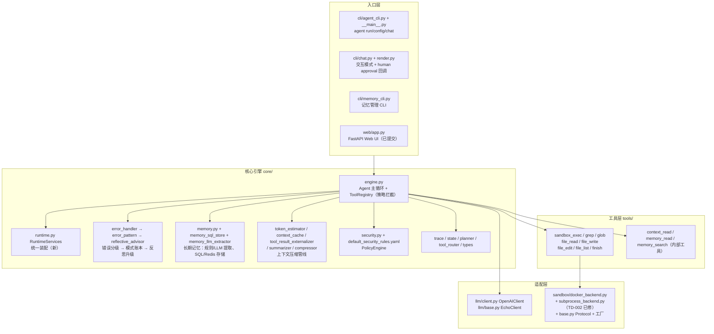
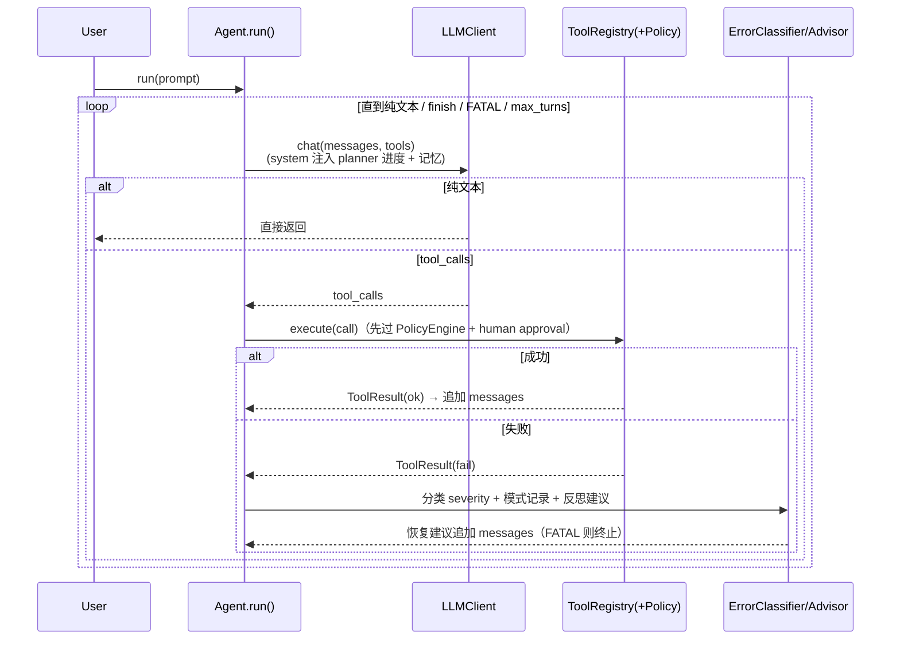

# CodeMap — Litmus Agent 项目总图（project mode）

> 生成：2026-08-22（SDD-RIPER-ONE `create_codemap`，project 模式，drift-check 后重建）
> 验证基线：`pytest tests/` = **924 passed, 1 skipped**（2026-08-22 实测，TD-016 + CR 回炉后）；mypy 52 文件零错误；ruff 全绿
> 上一版：`2026-07-17_20-38_hermes-agent-project.md`（41 文件/541 用例，已过期）
> 用途：代码库索引与上下文切片。后续会话按需按路径回读，不全量扫描。

---

## 1. 项目锚点

| 项 | 值 |
|---|---|
| 名称 | Litmus Agent（原 Hermes Agent） |
| 定位 | 具备自我纠错能力的代码沙箱 LLM Agent 框架：计划 → 写代码 → 沙箱执行 → 观察 → 修正 → 交付 |
| 路径 | `D:\myvibeproject\litmusAgent` |
| 包 | name=`agent`, version=`0.1.0`, Python >= 3.10；src-layout |
| 规模 | `src/agent/` 49 个 .py；`tests/` 56 个测试文件 |
| 质量门禁 | `pytest tests/ -q` + `mypy src/`（strict）+ `ruff check src/ tests/`（行宽 100） |
| venv | 项目内 `.venv/Scripts/python.exe`（2026-08-22 已补齐 fakeredis/sqlalchemy） |
| Git | `master`，HEAD = `de28aa4`；未提交：`technical-debt-spec.md`、`docs/session-context.md` |
| 依赖 | httpx, pydantic, rich, structlog, pyyaml, docker, fastapi, uvicorn, jinja2, sqlalchemy, redis, pymysql, cryptography；可选 extras: openai/anthropic |

---

## 2. 架构分层图



## 3. 主循环数据流（自我纠错闭环）



---

## 4. 模块索引（按路径回读）

### 4.1 入口层
| 路径 | 职责 | 关键符号 |
|---|---|---|
| `src/agent/cli/agent_cli.py` | argparse 主 CLI | `build_parser()`, `cmd_chat/run/config()`, `main()` |
| `src/agent/cli/__main__.py` | `python -m agent.cli` 入口 | — |
| `src/agent/cli/chat.py` | 交互式多轮对话 + 人工批准回调 | `run_chat_loop()`, `make_cli_approval_callback()` |
| `src/agent/cli/render.py` | Rich 渲染 + `--plain` 回退 | `render_result()` 等 |
| `src/agent/cli/memory_cli.py` | 记忆 list/show/delete/feedback/audit/export | `cmd_*()` |
| `src/agent/web/app.py` | FastAPI Web UI：按 session_id 内存保存 Agent，无 Key 回退 EchoClient | `app`, `ChatRequest/ChatResponse`, `_create_agent()` |

### 4.2 核心引擎 `core/`
| 路径 | 职责 | 关键符号 |
|---|---|---|
| `engine.py` | Agent 主循环、工具注册执行、策略拦截、记忆/压缩/Trace 接入点 | `Agent`, `ToolRegistry` |
| `runtime.py` | 🆕 运行时服务统一装配 | `RuntimeServices` |
| `types.py` | 基础数据类型 | `Message`, `ToolCall`, `ToolResult`, `ToolSpec` |
| `state.py` | 执行状态 | `AgentState`, `ExecutionContext` |
| `trace.py` | 执行轨迹 | `AgentTrace`, `TraceEvent` |
| `error_handler.py` / `error_pattern.py` / `reflective_advisor.py` | 错误分级 / 模式账本 / 反思升级 | `ErrorClassifier` 等 |
| `security.py` + `default_security_rules.yaml` | 策略引擎 | `PolicyEngine`, `PolicyRule` |
| `memory.py` | 长期记忆主模块（~1800 行） | `MemoryManager`, `StructuredMemoryStore`, `RuleMemoryExtractor`, `MemoryConflictDetector` 等 |
| `memory_sql_store.py` | 🆕 SQL/Redis 记忆存储 | `SqlMemoryStore` |
| `memory_llm_extractor.py` | 🆕 LLM 驱动记忆提取（TD-013） | `LLMMemoryExtractor` |
| `token_estimator.py` / `context_cache.py` / `tool_result_externalizer.py` / `summarizer.py` / `compressor.py` | 上下文压缩管线 | `HybridCompressor`, `Char/TiktokenTokenEstimator` 等 |
| `planner.py` / `tool_router.py` | 任务规划 / 工具提示 | `TaskPlan`, `PlanStep`, `ToolRouter` |

### 4.3 适配层
| 路径 | 职责 | 关键符号 |
|---|---|---|
| `llm/base.py` | 抽象 + 测试桩 | `BaseLLMClient`, `EchoClient` |
| `llm/client.py` | OpenAI 兼容（httpx，重试/超时/from_env；无流式） | `OpenAIClient` |
| `sandbox/base.py` | 🆕 沙箱抽象 | `SandboxBackend` Protocol, `ExecutionResult` |
| `sandbox/docker_backend.py` | Docker 全生命周期 + 命名 volume `/workspace` 持久化 | `DockerSandboxBackend` |
| `sandbox/subprocess_backend.py` | 🆕 本地子进程沙箱（TD-002 修复） | `SubprocessSandboxBackend` |
| `sandbox/__init__.py` | 工厂 | `create_sandbox_backend()` |

### 4.3b MCP 接入层
| 路径 | 职责 | 关键符号 |
|---|---|---|
| `src/agent/mcp_client.py` 🆕 | MCP server 连接/发现/工具包装（stdio+SSE+HTTP 三传输，惰性装配，close 回收） | `MCPManager` |

### 4.4 工具层 `tools/`
| 路径 | 说明 |
|---|---|
| `__init__.py` | `register_default_tools()` / `register_tools_from_config()` |
| `sandbox_exec.py` | 沙箱执行 Python |
| `grep.py` / `glob.py` 🆕 | 代码搜索：正则内容搜索 / 递归文件名匹配（`execute_code` 跑只读脚本，双后端兼容，条数+字节双截断） |
| `file_read/write/edit/list.py` | 文件操作（write/edit 走 `file/path` write 策略） |
| `finish.py` | 终止循环并交付 |
| `context_read.py` / `memory_read.py` / `memory_search.py` 🆕 | 内部工具（闭包注入） |

### 4.5 配置与日志
| 路径 | 说明 |
|---|---|
| `config.py` | Pydantic + YAML：`AgentConfig`（含 LLM/Sandbox/Security/Memory/Tools） |
| `logging.py` | structlog 双模式 |

---

## 5. 测试地形（61 个测试文件 + 1 个 fake server 辅助，924 passed / 1 skipped）

- 单元：`test_config / test_logging / test_core / test_agent_loop / test_state / test_planner / test_tool_router / test_llm_client`
- 沙箱/工具：`test_sandbox / test_tools / test_tool_security / test_sandbox_security / test_subprocess_backend / test_sandbox_factory`
- 机制：`test_trace / test_error_pattern / test_reflective_* / test_context_compression / test_security_* / test_runtime_services / test_execution_context / test_human_approval`
- 记忆专项（13+）：`test_memory_cache / conflict / extractor / feedback / integration / llm_extractor / manager / query_expansion / retrieval / search / security / store / store_contract`
- 入口：`test_cli / test_cli_chat / test_memory_cli / test_web_ui / test_examples / test_demo / test_docker_launch`
- 文档防腐：`test_architecture / test_usage_docs / test_readme / test_evaluation_log`
- 集成/端到端：`test_integration / test_reflective_integration / test_security_integration / test_memory_integration / test_e2e_suite / test_batch_e2e`

## 6. 评测体系（examples/）

- `batch_e2e.py` + 6 批次任务：`batch_tasks.py`(b1)、`batch_tasks_b2..b6.py` —— 125 任务，难度递进，断言/LLM-judge/工具路径三重判分，三机制臂对照，重复采样，token 成本可核算
- 其他：`simple_agent.py / run_once.py / with_config.py / e2e_suite.py / demo_real_llm.py / config.yaml`
- 批量报告：`docs/batch-e2e-batch1..6-report.md`

## 7. Spec 与技术债资产（mydocs/specs/，25 份）

- **项目级**：project-rebaseline（07-17）、resume-pipeline-framework-vision、project-star-finalization
- **技术债 TD-002~013**：subprocess-backend✅、execution-context-injection、runtime-services✅、human-approval✅、workspace-write-boundary、image-registry、test-env-isolation(TD-011/012)、llm-memory-extractor(TD-013)✅
- **功能**：real-llm-e2e-suite、auto-planner、showcase-narrative-tests、memory-layered-retrieval、memory-search-tool、query-expansion-memory、memory-sql-redis
- **评测**：batch-e2e-benchmark-seed + benchmark + batch2~6
- 历史体系：`.kimi/vibe_specs/`（28 份 + `technical-debt-spec.md`，当前有未提交改动）

## 8. 热点与风险（Execute 前必读）

1. ~~venv 依赖漂移~~（2026-08-22 已修：`pip install fakeredis sqlalchemy` 后全量基线 786 passed / 1 skipped，mypy/ruff 全绿）。
2. **未提交改动**：`.kimi/vibe_specs/technical-debt-spec.md`、`docs/session-context.md`。
3. 旧 codemap 风险已消解：TD-002（subprocess 沙箱）、Web UI、runtime 装配均已提交。
4. 未决 TD：**技术债总表已清零**（TD-001~015 全部完成，2026-08-22）。遗留非债事项：批量评测重新基线（grep/glob 进默认工具集后新旧批次口径不可比）；`memory_limit_mb` 配置存在但工厂未透传（TD-010 调研发现的既有遗漏）。
5. `OpenAIClient` 缺流式输出（功能缺口）。

## 9. 常用命令

```bash
source .venv/Scripts/activate
python -m pytest tests/ -q        # 基线 924 passed, 1 skipped
python -m mypy src/               # strict
python -m ruff check src/ tests/  # 行宽 100
```

---
*索引原则：本图只存路径与职责，细节按需回读源文件；代码大改后须 drift-check 本图。*
